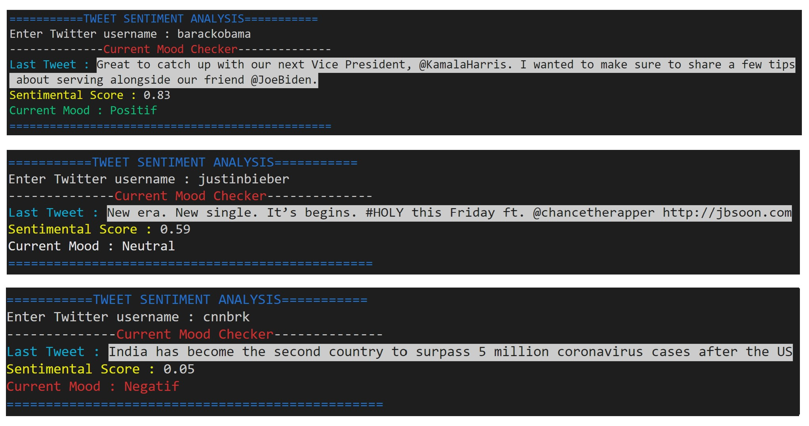

## :iphone:  Twitter Sentiment Analysis  :iphone:

### Build a deep learning sentiment classifier to determine the tone (positive, negative, neutral) of a tweet.

 
 
    

           

## :memo: PROCESS
*SA_Building_the_Models_(Word2Vec, SA_NeuralNet).ipynb*
- Scrap Twitter with GetOldTweets3 library
- Train a *Word2Vec* model for tweet vectorization
- Predict the sentiment score of the tweet (using a Neural Network model) 

## :mag_right: MODELS

<ul>
  
### <li> Word2Vec Model
*Word2Vec* is a neural network model that transforms words into vectors (words embeddings). 

We used the Gensim *Word2Vec* model and trained it using a corpus of tweets and there corresponding sentiment scores (http://help.sentiment140.com/for-students). 

Once trained, the *Word2vec* model can understand semantic similarity as shown on the picture below.

### <li> TF-IDF Matrix
The *Word2Vec* model converts each word from the corpus into a high dimensional vector.

To classify tweets, we have to turn them into vectors as well.

We "combine" these words-vectors together to get the tweet-vector by computing a weighted average (TF-IDF score - importance of the word in the corpus).

### <li> Keras Neural Network model
An other neural network model is trained to predict the sentiment score for a given tweet.

It is a Keras *Sequential* model using sigmoid activation function for the output layer (always return value between 0 and 1).

We used *EarlyStopping* to prevent from overfitting and callback function (*ModelCheckpoint*) to save the best model during training.

 

## :monorail: PIPELINE

- Scrap the last tweet of a given Twitter username (*GetOldTweets3* library)
- Tokenize the tweet => ['i', 'love', 'you'] (*nltk.tokenize.TweetTokenizer()*)
- Build tweet vectorization using *Word2Vec* model and *TF-IDF matrix*
- Feed the scaled tweet vector to the *Keras Neural Net* model to get the prediction

 

## :bulb: RESULTS

Entering the Twitter username of a person, we get his/her last tweet with a Sentiment Score prediction.

Here are some 'Mood Checks' I did to test the model :

